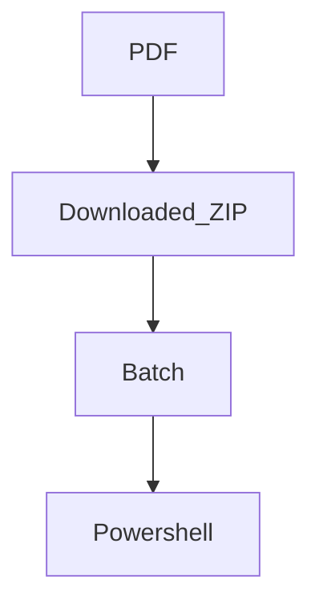

# Malicious PDF Document Analysis - Lazyscripter
|Table of Content| #
|------|
|##Introduction|
|###Summary|
### Blogpost3


# Blogpost4

##### Blogpost5

* [envirius](#envirius)
    * [Idea](#idea)
    * [Features](#features)
 * [Installation](#installation)
 * [Uninstallation](#uninstallation)
 * [Available plugins](#available-plugins)
 * [Usage](#usage)
 
*This is bold text*

```cmd
set data="Hello"
```

[Any Run](https://app.any.run/tasks/3cb42eba-669a-449f-b275-aa3777f91735/)

Here is a simple footnote[^1].


***

 
| First Header  | Second Header |
|:---- | :--: |
| Content Cell  | Content Cell  |
| Content Cell  | Content Cell  |


<details><summary>CODE</summary>
<p>

#### We can hide anything, even code!

    ```ruby
      puts "Hello World"
    ```

</p>
</details>
